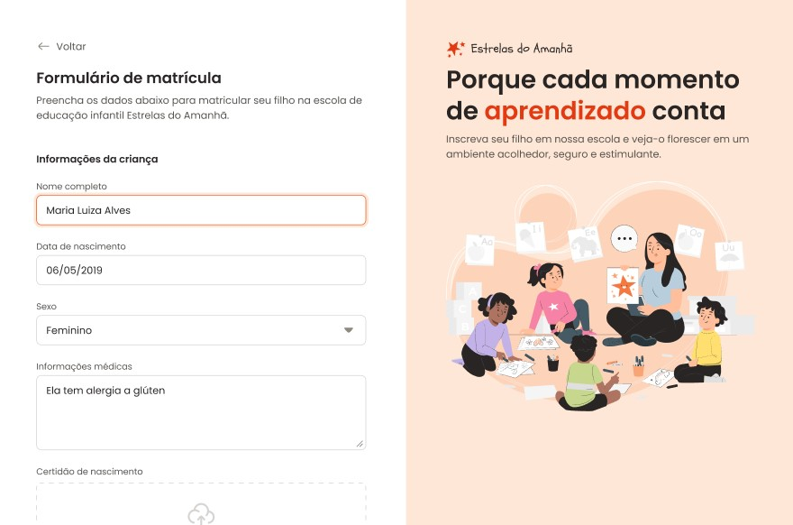

<h1 align="center"> Formulário de Matrícula </h1>

Projeto desenvolvido no curso Full Stack da Rocketseat.

  <a href="#-tecnologias">Tecnologias</a>&nbsp;&nbsp;&nbsp;|&nbsp;&nbsp;&nbsp;
  <a href="#-projeto">Projeto</a>&nbsp;&nbsp;&nbsp;|&nbsp;&nbsp;&nbsp;
  <a href="#-layout">Layout</a>&nbsp;&nbsp;&nbsp;|&nbsp;&nbsp;&nbsp;
  <a href="#memo-licença">Licença</a>

  

 

## 🚀 Tecnologias

Esse projeto foi desenvolvido com as seguintes tecnologias:

- HTML e CSS
- Git e Github
- Figma

## 💻 Projeto

O formulário de matrículas é um projeto para inscrição de crianças em aulas de esportes.

Nele pude aprimorar os conhecimentos sobre HTML e CSS, focando principalmente na construção de formulários e estilização dos campos utilizados.

## 🔖 Layout

Você pode visualizar o layout do projeto através [DESSE LINK](<https://www.figma.com/design/cyEkncFD8j6rEXrMDXTgvB/Formul%C3%A1rio-de-matr%C3%ADcula-(Community)?node-id=2190-1903&t=HdxPLZMk7sWyBdSn-1>). É necessário ter conta no [Figma](https://figma.com) para acessá-lo.

## :memo: Licença

Esse projeto está sob a licença MIT.

---